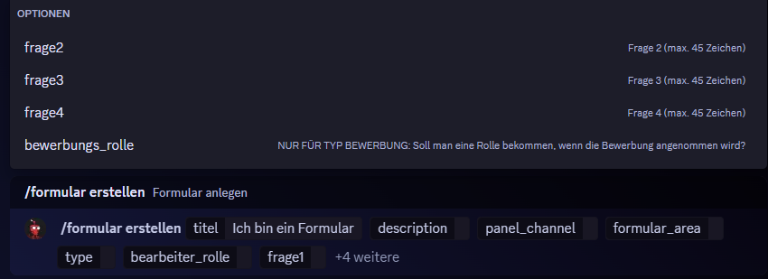
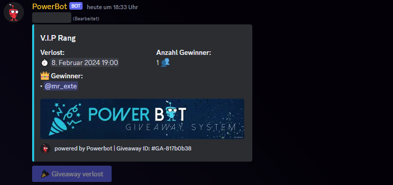

# /formular

**`/formular erstellen`**\
**Optionen:** titel / description / panel\_channel / formular\_area / type / bearbeiter\_rolle / frage1 / _frage2 / frage3 / frage4 / bewerbungs\_rolle_\
**Permission:** Administrator

* **Titel:** \
  Titel des Formulares. z.B.: Partnerschaftsanfrage,  Team Bewerbung, ...
* **Description:** \
  Beschreibung. Du kannst mit $n eine neue Zeile beginnen. Info zu $n siehe >> hier <<
* **Panel\_Channel:**\
  In diesen Channel wird das Formular Panel gepostet
* **Formular\_Area:**\
  In dieser Kategorie wird automatisch das Forum für dein Formular erstellt. Wir empfehlen eine eigene Kategorie, die z.B. "Formulare" heißt. Für jedes Formular wird ein Formular-Forum erstellt
* **Type:**\
  Hier wählst du aus, ob es ein normales Formular oder ein Bewerbungsformular sein soll
* Bearbeiter\_Rolle:\
  Personen mit dieser Rolle, können übermittelte Formulare bearbeiten und sehen. Sie werden automatisch beim Forum hinzugefügt, sodass sie diese sehen und auch bearbeiten können.
* **Frage 1-4:**\
  Frage 1 ist ein Pflichtfeld. Die anderen sind optional
* **Bewerbungs\_Rolle:**\
  Bei Bewerbungsformularen kannst du eine Bewerbungs-Rolle definieren. Diese wird dem Member automatisch gegeben, wenn die Bewerbung angenommen wird

<figure><figcaption></figcaption></figure>

Hier ein Beispiel, wie es bei uns eingerichtet ist:

<figure><figcaption>
Unsere Formular_Area ist "💼 | BEWERBUNGEN". Für die beta-phase und die team-bewerbung gibt es jeweils einen Channel, den User sehen können und wo sie das Recht "In Threads schreiben" haben. Dann gibt es für jedes Formular ein Forum. Diese können normale User natürlich nicht sehen. Diese Einstellung übernimmt der Bot für dich. 
</figcaption></figure>
