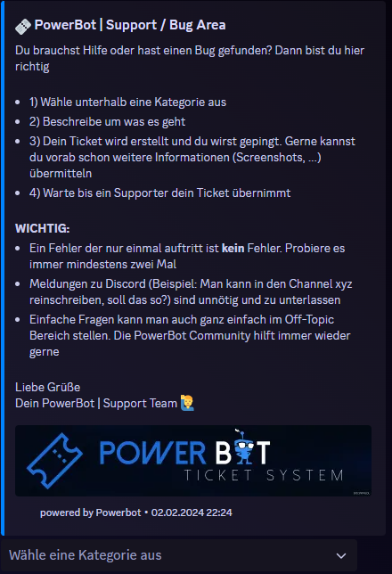

# /tickets

_<mark style="background-color:orange;">Wichtig: Das Ticket System muss vorab im Dashboard eingerichtet werden! Erst danach können Ticket-Panels erstellt werden.</mark>_

**`/tickets createpanel`**\
**Beschreibung:** Erstellt im ausgewählten Channel ein Ticket Panel mit einem Dropdown Menü. Dort wählt ein User dann die Kategorie aus. Danach öffnet sich ein Modal, wo noch Informationen abgefragt werden. Im Anschluss wird im Channel ein private Thread erstellt und ein Info-Embed in die Ticket-Area (Im Dashboard definieren) gesendet. Optional kann man bei der Erstellung eines Panels Kategorien angeben und eine Accessrole auswählen. Lässt man diese Optionen aus, werden die Standardwerte genommen, die man im Dashboard definiert hat.\
**Optionen:** Titel / Beschreibung / Channel / Kategorien / Accessrole\
**Permission:** Administrator

<figure><figcaption></figcaption></figure>

<mark style="color:yellow;">**WICHTIG: @everyone braucht das Recht "Nachrichten in Threads senden" und "Kanal anzeigen", damit User zum Ticket hinzugefügt werden kann.**</mark>

<figure><figcaption></figcaption></figure>

**`/tickets deletepanel`**\
**Beschreibung:** Generiert ein Dropdownmenü wo man das Ticket-Panel auswählen kann, dass man löschen möchte\
**Optionen:** –\
**Permission:** Administrator
