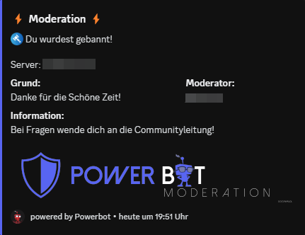
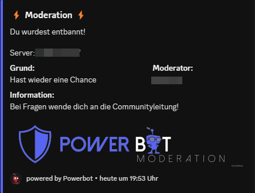
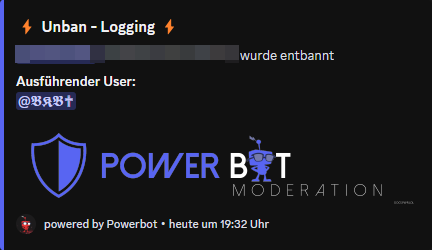

# /ban

**`/ban`**\
**Optionen:** User / Delete / Reason\
**Permission:** Kick Member + Mod-Role

<figure><figcaption></figcaption></figure>

<figure><figcaption></figcaption></figure>

**`/unban`**\
**Optionen:** Userid / Reason\
**Permission:** Kick Member + Mod-Role

<figure><figcaption></figcaption></figure>

<figure><figcaption></figcaption></figure>
