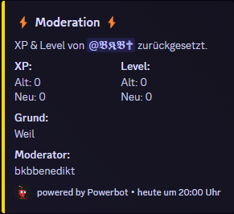

# /xp

**`/xp give`**\
**Beschreibung:** Gibt dem ausgewählten Member XP\
**Optionen:** User / Amount / Reason\
**Permission:** Kick Member

<figure><figcaption></figcaption></figure>

**`/xp remove`**\
**Beschreibung:** Entfernt vom ausgewählten Member XP\
**Optionen:** User / Amount / Reason\
**Permission:** Kick Member

<figure><figcaption></figcaption></figure>

`/xp reset`\
**Beschreibung:** Entfernt alle XP vom jeweiligen User\
**Optionen:** User / Reason\
**Permissions:** Kick Member\

<figure><figcaption></figcaption></figure>
