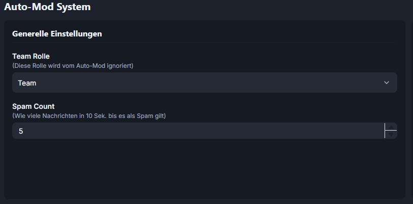
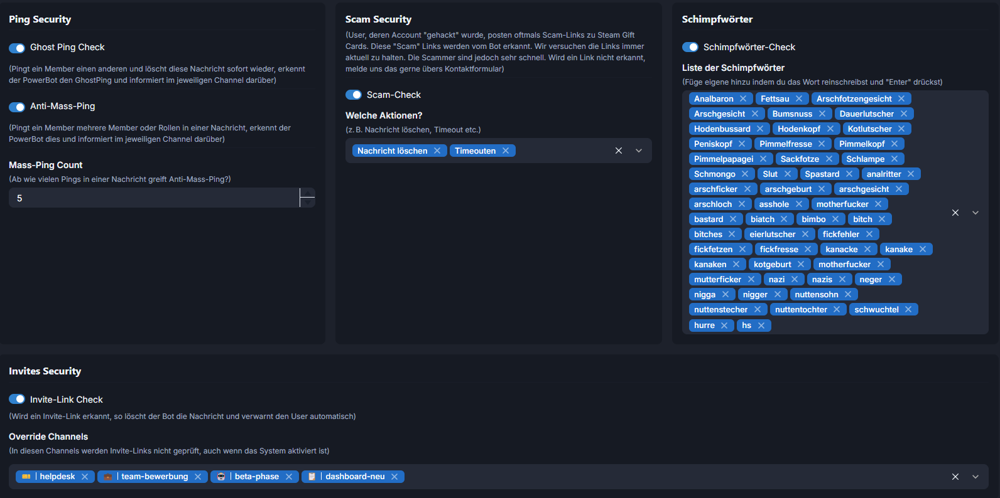
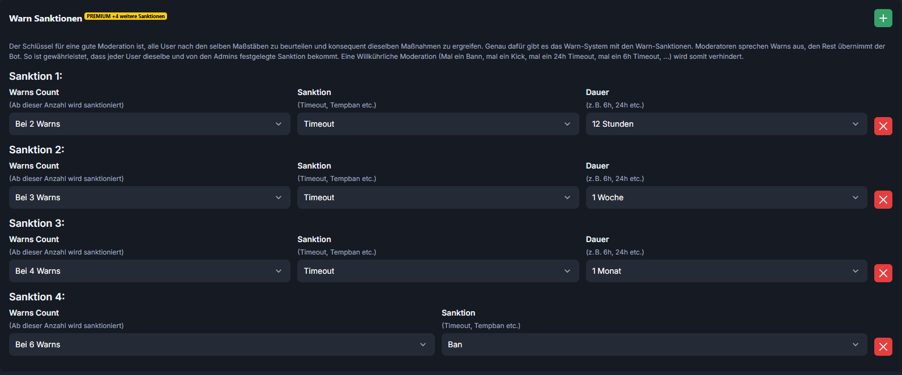

# Auto Mod Settings

Unser Auto-Mod System sorgt dafür, dass dein Discord clean bleibt und sperrt verdächtige User sofort per Timeout aus. Details zum Feature gibt es [>>> HIER <<<](../features/auto-mod-system.md)

***

Hier kannst du alles zum Thema Auto-Mod einstellen.&#x20;

Als ersten Punkt kannst du die Härte des Auto-Mods in Bezug auf Spam einstellen. "5" ist unserer Meinung nach der optimale Wert. Umso höher der Wert ist, umso länger dauert die Spam-Erkennung.

<figure><figcaption></figcaption></figure>

Weiter unten kannst du einstellen, ob User verwarnt werden sollen, wenn sie Discord-Invites posten. Darunter stehen wir drei mögliche Warn-Sanktionen zur Verfügung. Du kannst selber bestimmen ab wie vielen Warns sich der PowerBot Auto-Mod aktiviert und Sanktionen zieht. Auch diese kannst du ganz simpel definieren.&#x20;

Du definierst, dass ein User...

...bei x Warns...

für x Stunden / Tage / Wochen ...

...ein Timout / einen Tempban / ....

bekommt.

<figure><figcaption></figcaption></figure>

<figure><figcaption></figcaption></figure>
