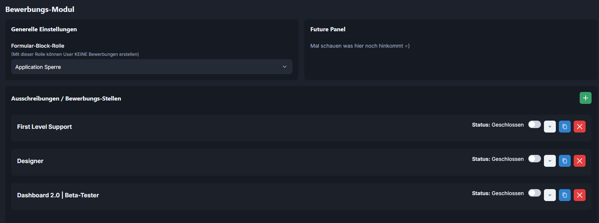
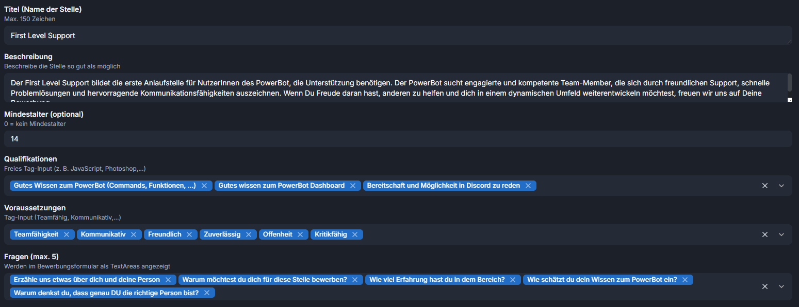
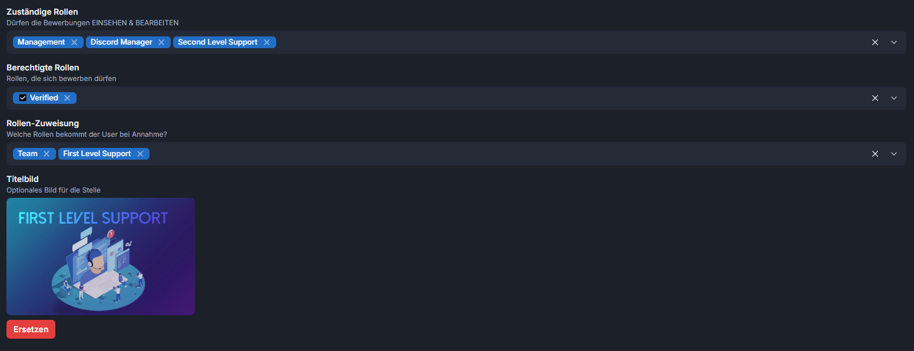
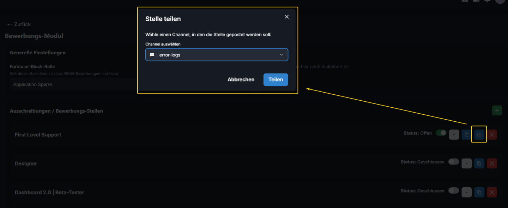

# Bewerbungs Settings

Im "Menü" kann man die Bewerbung Öffnen oder Schließen. Man kann sie zusätzlich kopieren, sodass man z.B. eine ähnliche Bewerbung nich neu machen muss, sondern sie kopieren kann.

<figure><figcaption></figcaption></figure>

In diesem Menü kann man dann alles einstellen wie z.B. Titel, Beschreibung, Mindestalter, Qualifikationen, Fragen oder Vorrausetzungen.

<figure><figcaption></figcaption></figure>

Man kann Rollen einstellen die das Recht haben diese zu Verwalten, Rollen einstellen die ein User braucht um sich zu bewerben und eine Rolle die bei annahme gegeben wird.

<figure><figcaption></figcaption></figure>

Man kann eine Bewerbung mit einem Channel vom Discord teilen, die dann so als Embed gepostet werden:

<figure><figcaption></figcaption></figure>

<figure><figcaption></figcaption></figure>
