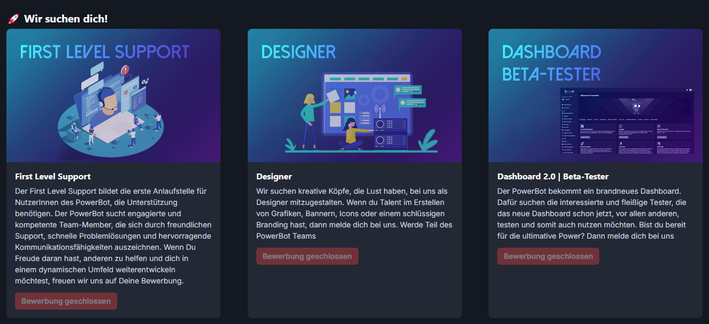
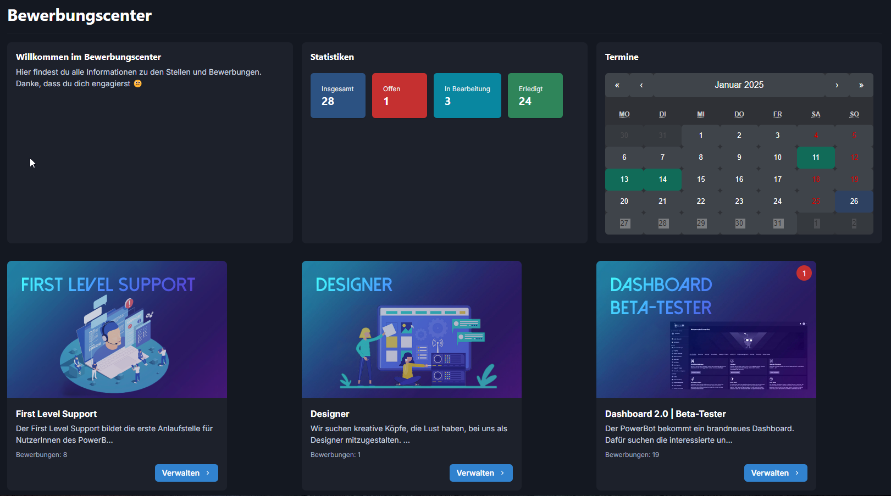

# Bewerbungscenter

Moderator können Interne Notizen festlegen die nur Moderator sehen können.\
Es gibt einen Aktiven Chat der Live versendet wird d.h. man braucht die Seite nicht neu-laden sondern man kriegt die Nachrichten direkt.\
Termine kann man für ein Gespräch auch vereinbaren.&#x20;

<figure><figcaption></figcaption></figure>

Im Bewerbungscenter kann man seine Bewerbungs-Stats, Termine und Anzahl Bewerbungen pro Stelle.

<figure><figcaption></figcaption></figure>
