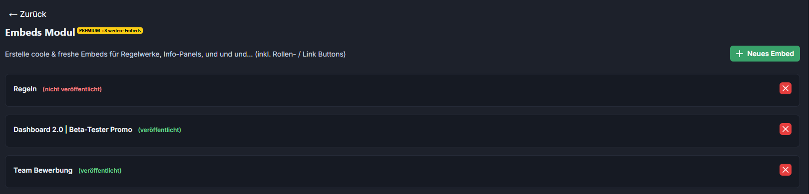
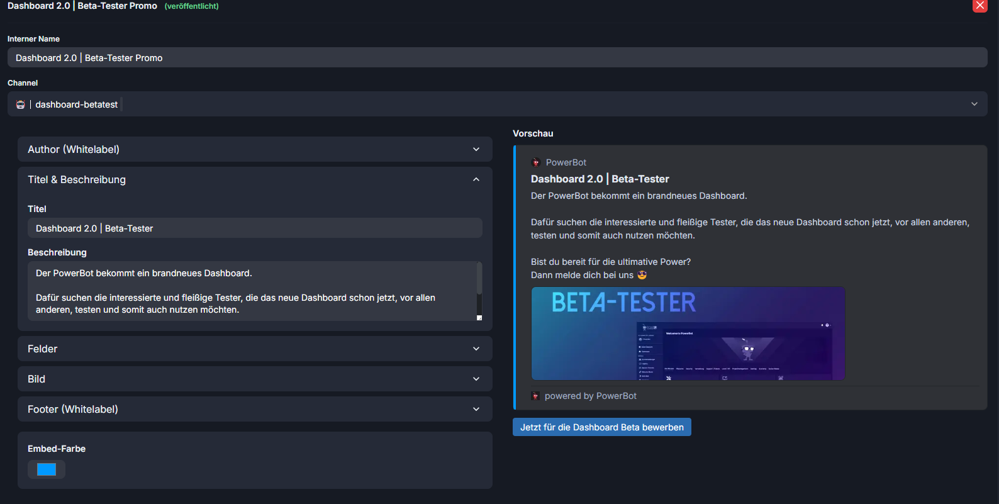
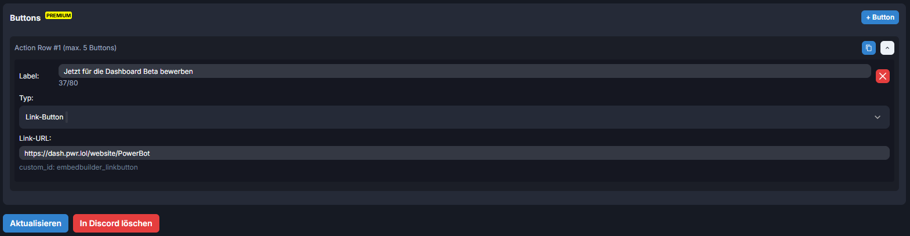

# Embed-Builder Settings

<figure><figcaption></figcaption></figure>

Man kann sich den Namen, die Bilder, die Beschreibung und die Felder selbst konfieguriren.

<figure><figcaption></figcaption></figure>

Man kann zusätzlich Buttons hinzufügen und diese als Link-Button oder als Role-Button konfiegurieren.

<figure><figcaption></figcaption></figure>
