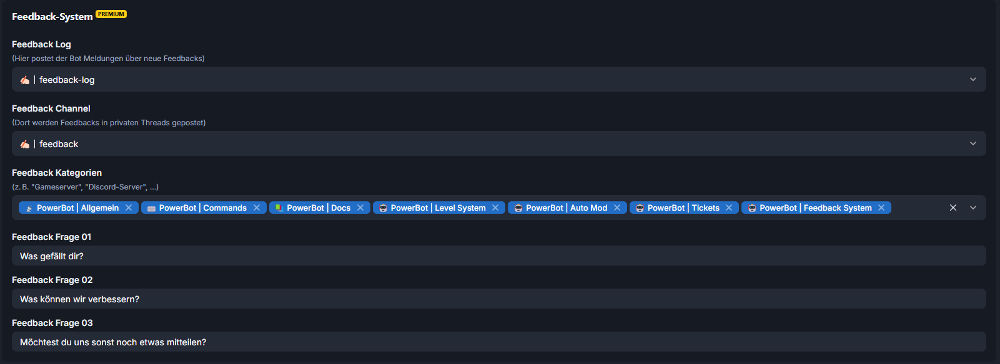
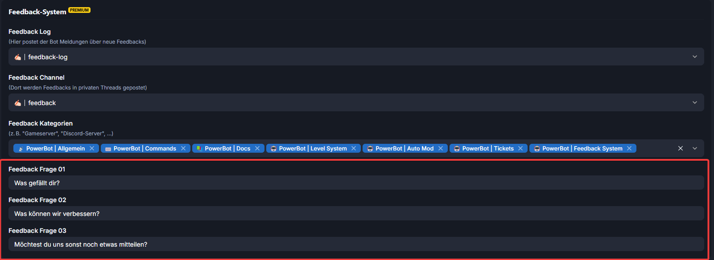

# Feedback Settings

Logge dich im Dashboard ein und wechsle zum Menüpunkt "Projektmanagement"

Kümmere dich erstmal um die Grundeinstellungen:

<figure><figcaption></figcaption></figure>

**Feedback Log:** \
Der Bot informiert in diesem Channel über neue Feedbacks

***

**Feedback Channel:** \
Hier wird das Feedback in einem privaten Thread gepostet. Das bietet dir die Möglichkeit auf das Feedback zu reagieren und den Member ggf. hinzuzufügen.

***

**Feedback Kategorien:**\
Diese Kategorien werden dem Feedback Panel hinzugefügt, wenn du es per /feedback createpanel erstellst.

Hast du das erledigt, kannst du dich um die Fragen kümmern:

<figure><figcaption></figcaption></figure>

Nun ist das Feedback System konfiguriert.&#x20;

[>>> Zu den Feedback Commands <<<](../commands/admin-commands/feedback.md)

\>>> Zu der Feature Beschreibung <<<
