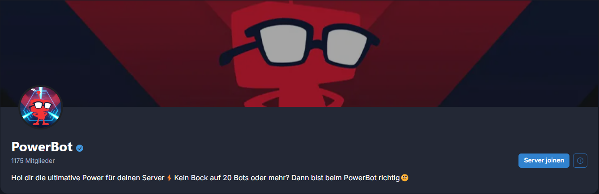
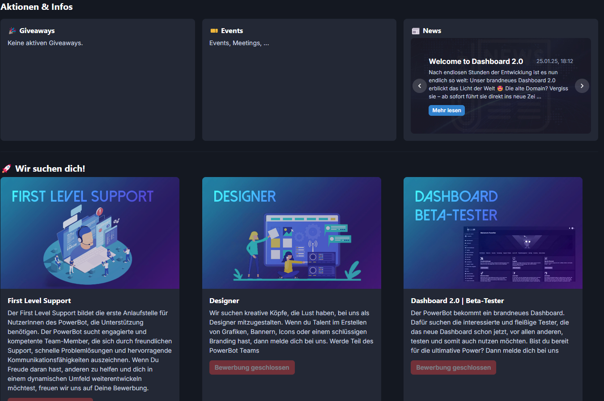

# Server-Website

Wenn man einen Link zum Server einträgt kommt automatisch ein Button wo dann User dem Server joinen können.

<figure><figcaption></figcaption></figure>

Man kann auch aktuelle Giveaways, Events, News und Bewerbungen einsehen.

<figure><figcaption></figcaption></figure>
