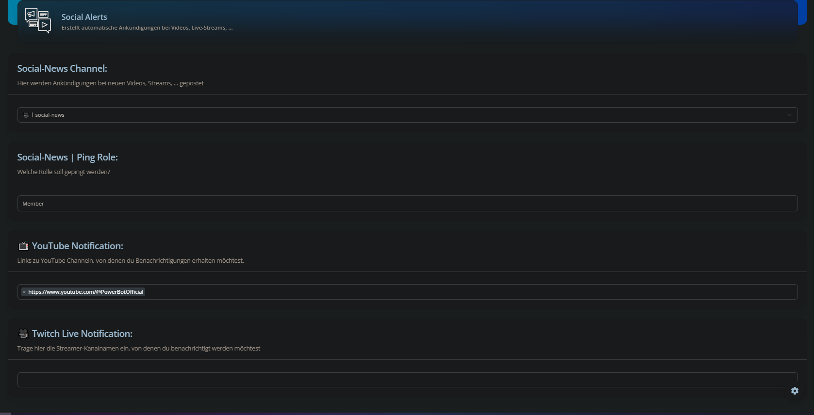

# Social Alerts Settings

**Social-News Channel:**

Wähle den Channel aus, in dem Ankündigungen bei neuen Videos, Streams, ... gepostet werden.

***

**Social-News | Ping Role:**

Wähle aus, welche Rolle bei neuen Videos, Streams, ... gepingt werden soll.

***

**YouTube News:**

Gib hier die Links zu YouTube Kanälen an, von denen du Benachrichtigungen erhalten möchtest an.&#x20;

***

**Twitch Live Notification:**

Trage hier die Kanalnamen, von denen du Benachrichtigungen erhalten möchtest an. Wichtig: Kanalnamen! Keine Links

<figure><figcaption></figcaption></figure>
