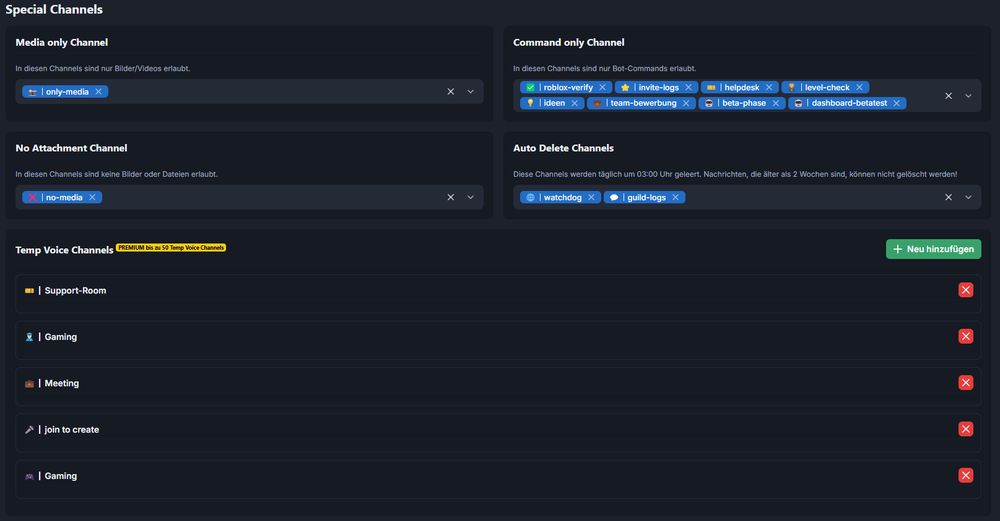

# Special Channels Settings

Wie die Beschreibung schon sagt, kannst du hier Channels definieren, in denen nur spezielle Sachen erlaubt sind. Es sollte selbsterklärend sein:

<figure><figcaption></figcaption></figure>

