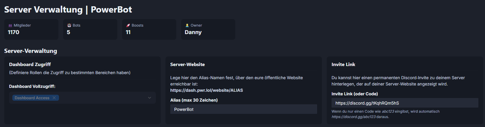
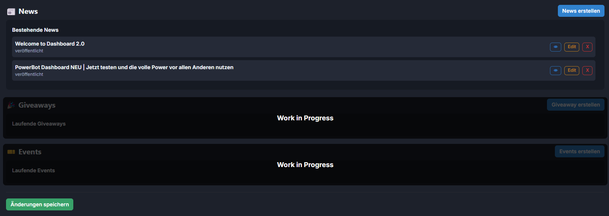

# Verwaltungs Settings

Zurzeit kann man nur News direkt übers Dasboard posten. Für die Zukunft ist geplant, dass man Giveaways und Events dirket übers Dashbaord posten kann.\
Man kann auf seiner Verwaltungs-Seite die Stats vom Server sehen, also Member-Anzahl, Bots, Boosts und den Owner.

<figure><figcaption></figcaption></figure>

<figure><figcaption></figcaption></figure>
