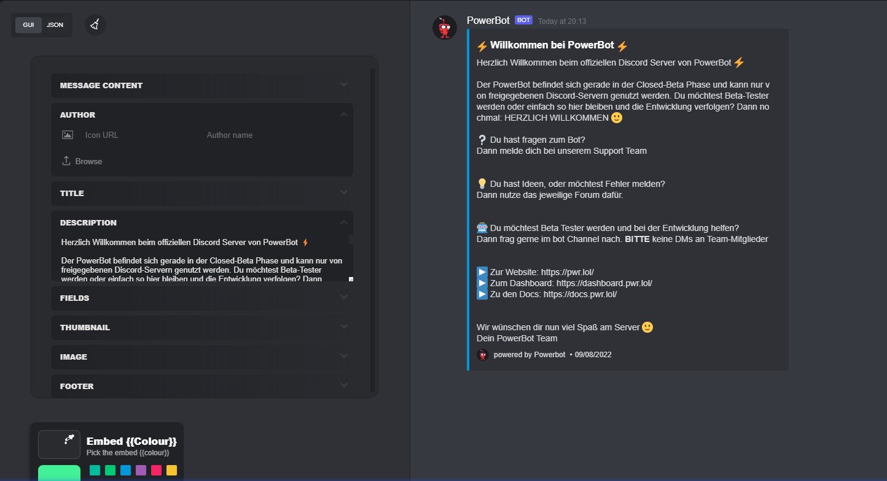

# Welcome Message

Welcome Channel:

Gib den Channel an, in dem die Welcome Message gesendet wird, wenn ein User joint.\

***

Community Rollen:

Gib die Rollen an, die ein User automatisch bekommt, wenn er dem Server joint.

***

Welcome Message Text:

Der Text, der im Welcome Channel, über dem Welcome Banner, gepostet wird, wenn ein User joined.

***

Hintergrundbild-Link:

Gib den Link zum Hintergrundbild für den Welcome-Banner an.

<mark style="background-color:orange;">(Größe 700x350 px)(Format: jpg|png)</mark>

***

Willkommens DM:

Aktiviere/Deaktiviere, dass eine Willkommens DM an den User geschickt wird.

***

<mark style="background-color:orange;">Bilder Upload funktioniert noch nicht -> WIP</mark>

<figure><figcaption></figcaption></figure>
