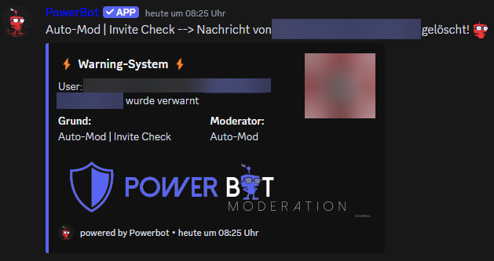
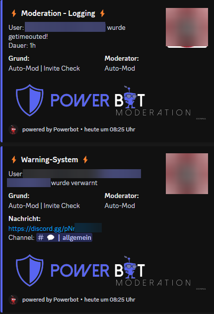

# Anti-Raid

Das Spam System filtert solche Attacken sofort raus, sperrt die Angreifer und meldet es automatisch an die Moderatoren.

**Wie macht der Bot das?**\
Im Detail werden wir das natürlich nicht verraten 🤫 Aber wie schon mal gesagt: Ein bisschen was von hier 🍪 Ein bisschen was von dort 🍿 Kräftig rühren und schütteln 🍹 Dann ein bisschen Magie 🧚‍♂️ Achja und viel Power ⚡️💥\
\
Spaß beiseite:

* Das Spam System bietet den ersten Schutz vor Angreifern. Bots posten sehr schnell und sehr viel bzw. sie versuchen es. Der PowerBot reagiert jedoch sofort und verpasst dem User ein Timeout. Zudem werden die Spam-Nachrichten gelöscht. Der Bot meldet es dann den Moderatoren, sodass diese weitere Schritte (z.B Ban) durchführen können. Warum bannt der Bot nicht sofort? Dies handhabt jeder Discord-Owner anders. Wir haben uns für ein Timeout entschieden, sodass jedem Discord-Owner die Möglichkeit gegeben wird, selber zu entscheiden, was mit dem User passiert\

* Accounts die von Bots übernommen wurden, wollen in allen Channeln einen Invite-Link zu einem anderen Discord Server posten. Der PowerBot gleicht den Link in Hyperspeed mit dem eigenen Discord Server ab. Passt dieser nicht dazu, wird die Nachricht gelöscht und der User wird wiederum sofort getimeouted und den Moderatoren gemeldet.

So sieht ein Vorfall im Channel aus:

<figure><figcaption></figcaption></figure>

So sieht es im Mod-Log aus:

<figure><figcaption></figcaption></figure>

