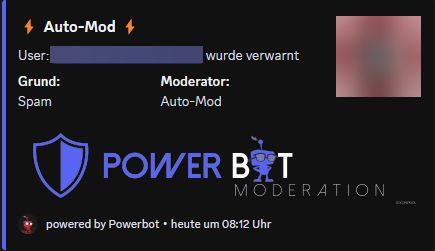
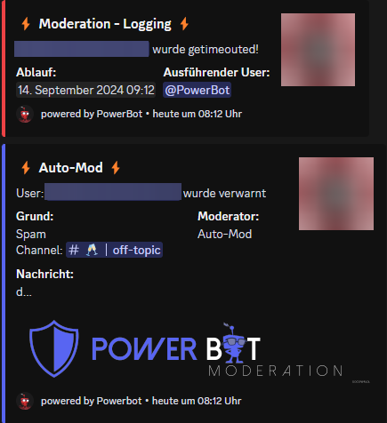

# Auto Mod System

Das Auto-Mod System sorgt dafür, dass dein Discord clean bleibt und sperrt verdächtige User sofort per Timeout aus. Hierfür gibt es verschiedene Systeme. Unter anderem das [Anti-Raid System](anti-raid.md)

Konfiguriert wird alles über das [Dashboard](../dashboard/auto-mod-settings.md)\
Dort kannst du das Auto-Mod-System deinen Bedürfnissen nach anpassen.

Auch kannst du einstellen, nach wie vielen Nachrichten, innerhalb von 10 Sekunden, das Anti-Spam greift. Hierbei als Info: Schreitet der Auto-Mod | Spam ein, wird der User automatisch für eine Stunde getimeouted und verwarnt. Dies gibt den Moderatoren die Möglichkeit zu reagieren und weitere Sanktionen zu ziehen. Insbesondere bei Raids ist dies sehr hilfreich, da der Angriff sofort gestoppt wird.

***

So sieht es aus, wenn der Auto-Mod aktiv wird:

<figure><figcaption></figcaption></figure>

 

<figure><figcaption></figcaption></figure>

<figure><figcaption></figcaption></figure>

