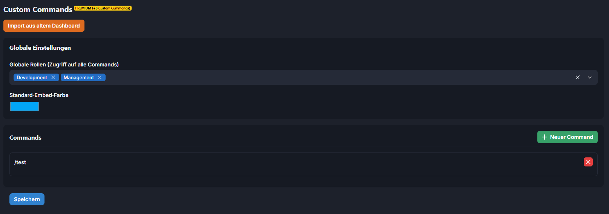

# Custom Commands

Du kannst die Custom Commands ganz einfach übers Dashboard einrichten ! Wenn du das getan hast kannst du z.B. !ichbinsuper benutzen. Daraufhin wird die Nachricht gelöscht und das Embed gepostet.\
Ihr könnt bis zu 10 Custom Commands im Dashbaord einstellen.

<figure><figcaption></figcaption></figure>

<figure><figcaption></figcaption></figure>
