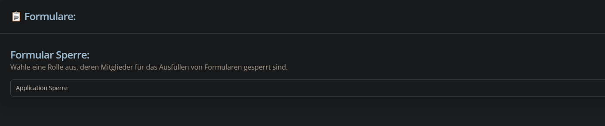
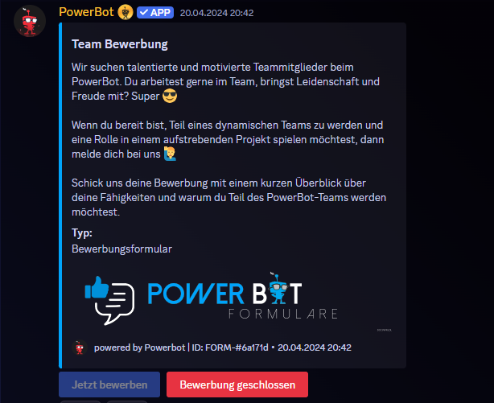

# Formulare

Bei der Erstellung von Formularen musst du dir keine Gedanken um irgendwelche Einstellungen und Berechtigungen machen. Der Bot macht das alles für dich.&#x20;

Du kannst Formulare per Button öffnen der schließen. So hast du jederzeit die Kontrolle über deine Formulare und kannst z.B. Team-Bewerbungen schließen, wenn du momentan keine mehr suchst.

Außerdem kannst du im Dashboard unter "Generelle Einstellungen" eine Rolle definieren, die für das Ausfüllen von Formularen gesperrt ist. So kannst User für Formulare sperren, wenn sie sich nicht an die Regeln halten und z.B. trollen.

[>>> Hier gehts zur Beschreibung des Commands <<<](../commands/admin-commands/formular.md)

<figure><figcaption></figcaption></figure>

<figure><figcaption></figcaption></figure>
