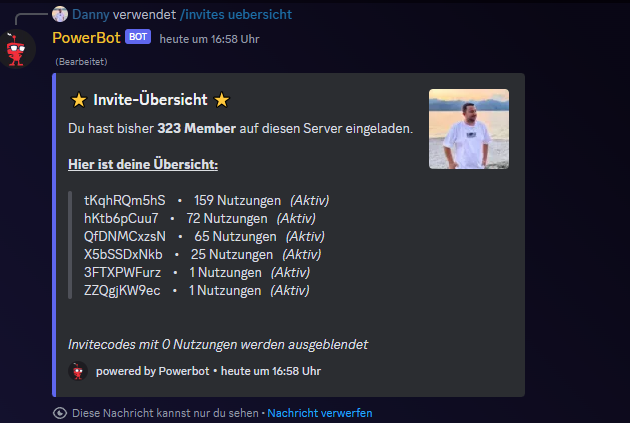

# Invite Logging

Das Invite-Logging gibt dir einerseits die Information durch welchen Invite-Link der Member auf deinen Discord-Server gekommen ist. Andererseits kannst du bei deinen Membern einen ultimativen Wettkampf auslösen. Ganz nach dem Motto: "Wer hat mehr Leute auf deinen Server geholt?"

Was macht das System:

* Im Dashboard findet man unter "Invite System -> Basiseinstellungen" den Punkt "Invite-Log". Dort wählt man einen Channel aus. Wer seine Member motivieren möchte, dass sie ihre Freunde einladen, sollte hier den selben Channel wie den "Welcome Channel" auswählen.\

*   Eine Nachricht mit "{member} wurde von {inviter} eingeldaden. Einladungs-Count: ..." wird in den Invite-Log Channel geschickt. \
    \
    So kann es aussehen, wenn der "Invite-Log Channel" und "Welcome Channel" ident sind:

    

    <figure><figcaption></figcaption></figure>

    

* Joined ein Member auf deinem Server, wird überprüft, von wem der Invite-Code ist. Diese Person bekommt 50XP gutgeschrieben\

*   Per /invites uebersicht kannst man sich anzeigen lassen, welche Invite-Codes man aktiv hat und wie viele Personen diesen benutzt haben:

    

    <figure><figcaption></figcaption></figure>

    

* Feature in Planung:
  * Leaderboard
  * Nachricht an User, wenn jemand seinen Invite-Link genutzt hat
  * Invite-Codes im Dashboard vom Logging ausnehmen -> z.B. Allgemeiner Server Invite-Code
