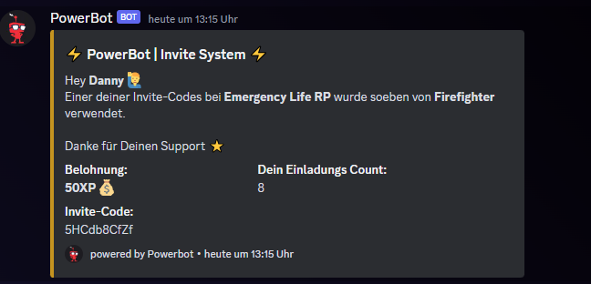

# Invite Tracker

Das Invite-System gibt dir einerseits die Information durch welchen Invite-Link der Member auf deinen Discord-Server gekommen ist. Andererseits kannst du bei deinen Membern einen ultimativen Wettbewerb auslösen. Ganz nach dem Motto: "Wer hat mehr Leute auf deinen Server geholt?"

**Was macht das System:**

* Im Dashboard findet man unter "Invite System -> Basiseinstellungen" den Punkt "Invite-Log". Dort wählt man einen Channel aus. Wer seine Member motivieren möchte, dass sie ihre Freunde einladen, sollte hier den selben Channel wie den "Welcome Channel" auswählen.\
  \
  Eine Nachricht mit "{member} wurde von {inviter} eingeladen. Einladungs-Count: ..." wird in den Invite-Log Channel geschickt. \
  \
  So kann es aussehen, wenn der "Invite-Log Channel" und "Welcome Channel" ident sind:

<figure><figcaption></figcaption></figure>

* Joined ein Member auf deinen Server, schaut der Bot von wem der Invite-Code ist (Inviter) und ob der Member schon Mal durch diesen Invite-Code auf den Server eingeladen wurde. Ist der Member neu und hat den Invite-Code noch nicht benutzt, dann bekommt der "Inviter" 50XP gutgeschrieben.\

*   Im Dashboard kann man auswählen, ob Inviter eine Nachricht bekommen sollen, wenn ihr Invite-Code benutzt wurde. Aktiviert man diese Option, sieht es so aus:\

    

    <figure><figcaption></figcaption></figure>

    

* Per /invites uebersicht kann man sich seine aktiven Invite-Codes inkl. Zahl der Nutzungen anzeigen lassen:

<figure><figcaption></figcaption></figure>

*   Möchte man Invite-Codes vom Logging ausnehmen _(z.B. allgemeine Invite Codes, die vom Team erstellt wurden),_ kann man dies auch im Dashboard konfigurieren. Hier ein Beispiel:\

    

    <figure><figcaption></figcaption></figure>

    

* Feature in Planung:
  * Leaderboard
