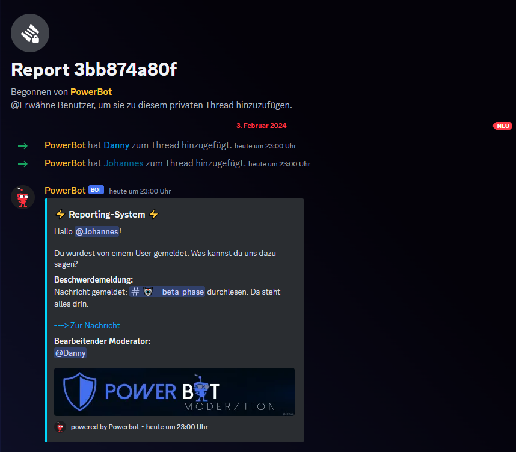
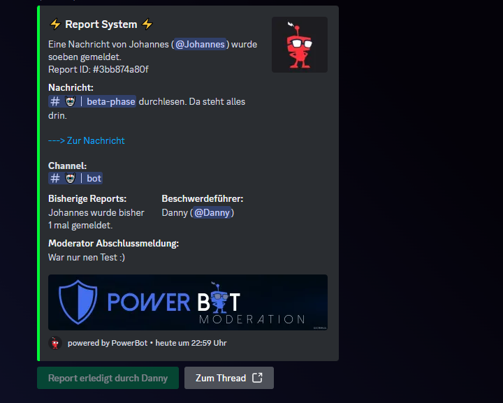

# Nachrichten melden

Es reicht ein simpler Rechtsklick auf eine Nachricht –> Apps –> Nachricht melden und den Rest erledigt der Bot.

<figure><figcaption></figcaption></figure>

Wird eine Nachricht gemeldet, sendet der Bot ein Embed in den Report-Log bzw. Mod-Log Channel. Ein Moderator kann den Report dann übernehmen und entscheiden ob er den User dazu befragt und einen Thread erstellt, oder ob er den Report gleich anhand der vorliegenden Informationen löst und erledigt oder ablehnt.

<figure><figcaption></figcaption></figure>

 

<figure><figcaption></figcaption></figure>

In unserem Fall wird ein Thread erstellt. Der Reporter bekommt eine DM, dass sein Report nun bearbeitet wird. Zudem wird ein Thread erstellt wo der Autor der Nachricht und der Moderator hinzugefügt werden.

<figure><figcaption></figcaption></figure>

Wurde der Report bearbeitet und geklärt, klickt der Moderator auf „Report als erledigt markieren“. Es öffnet sich ein Modal, bei dem man die Abschlussmeldung eingibt. Danach wird der Thread archiviert und der Reporter bekommt eine DM, dass sein Report nun erledigt wurde.

<figure><figcaption></figcaption></figure>

 
