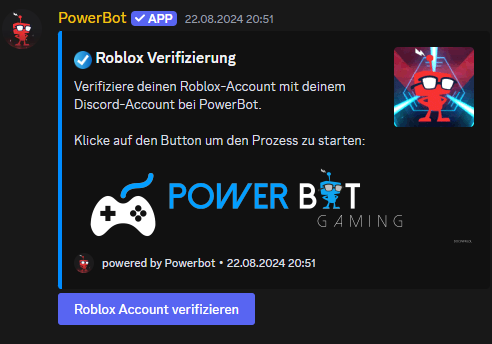

# Roblox-Verifizierung

Richte im Dashboard einfach deine Verifizierungs-Rolle aus und sage ob der User nachher nach seinen Roblox-Username bennant werden soll. Danach kannst du ganz einfach `/roblox create_verifypanel` machen und dann können sich deine Member verifizieren !

<figure><figcaption></figcaption></figure>
