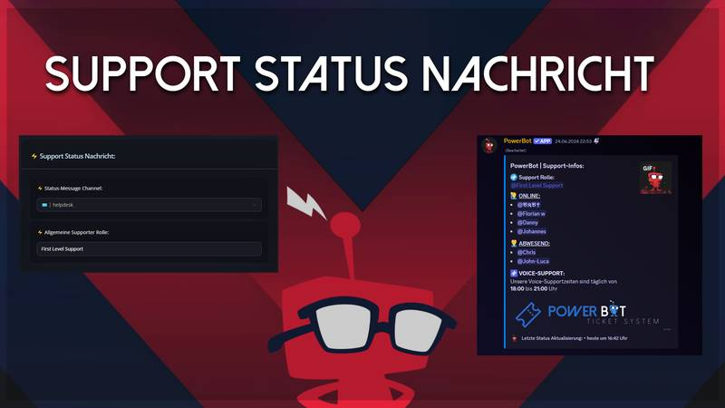
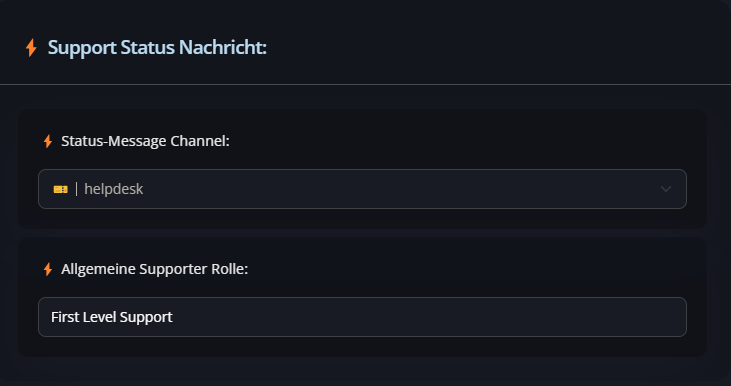

# Support Status Nachricht

Das Feauture kann man ganz einfach im Dashbaord einrichten. Danach wird es im Ausgewähltem Channel gepostet und wird alle 2 Minuten geupdated.

<figure><figcaption></figcaption></figure>

<mark style="color:yellow;">**HINWEIS:**</mark> \
Nach dem Einrichten kann es bis zu 2 Minuten dauern bis die Nachricht im Channel erscheint.

<figure><figcaption></figcaption></figure>
