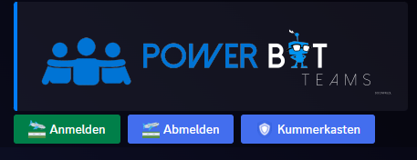
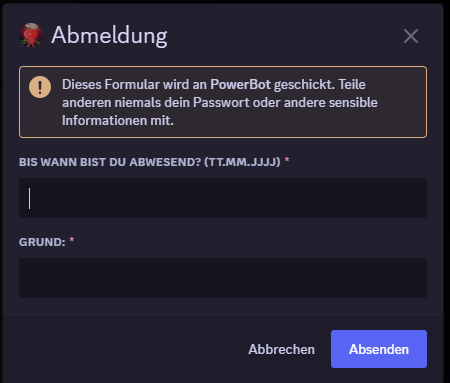
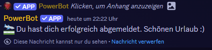
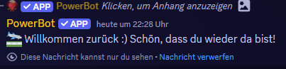

# Team-Panel

Die Team-Member können sich mit verschiedenen Buttons sich an und abmelden. Daneben ist ein Button namens "Kummerkasten", mit dem können die Team-Member eine Nachricht zu den Admins schicken wenn sie sorgen haben oder sich mit etwas nicht zurecht finden.

[>> Hier <<](../dashboard/team-panel-settings.md) findest du die Einstellungen im Dashboard.

[>> Hier <<](../commands/admin-commands/team.md) findest du die Team-Panel Commands.

<figure><figcaption></figcaption></figure>

<figure><figcaption></figcaption></figure>

<figure><figcaption></figcaption></figure>

<figure><figcaption></figcaption></figure>

<figure><figcaption></figcaption></figure>
