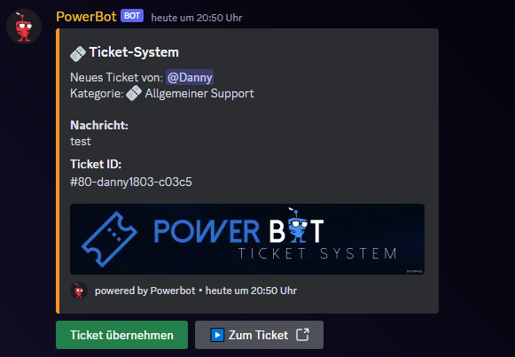
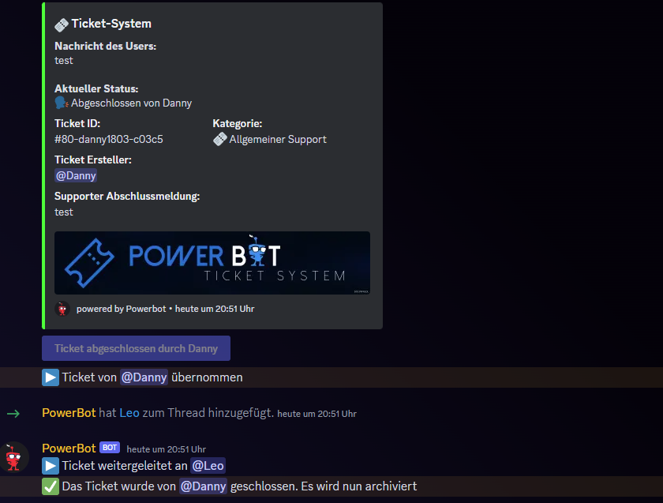
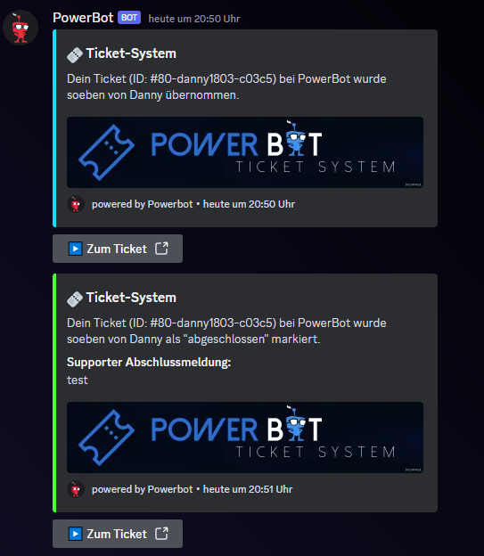
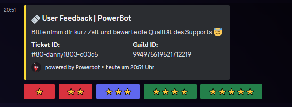
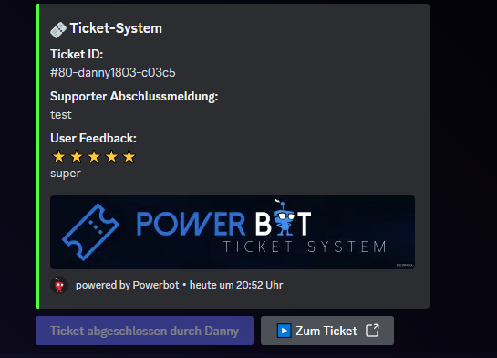

# Ticket System

Wir arbeiten nicht mit hässlichen Channels, die deinen Discord zumüllen. Bei uns gibt es Threads die noch dazu archiviert werden. Du brauchst somit nicht immer irgendwelche Websites öffnen um sehen zu können was da war. Du hast alles was du brauchst direkt auf deinem Discord. Achja und was wäre ein Ticket ohne Bewertungen? Das können User nämlich auch. Nicht nur mit Sternchen, sondern auch mit Text.

Über das Ticket Panel kann ein Ticket erstellt werden:

<figure><figcaption></figcaption></figure>

In der Ticket-Area wird das Ticket dann gepostet. Ebenso wird im Channel, wo sich das Ticket-Panel befindet, ein Thread erstellt. Übernimmt ein Supporter ein Ticket, wird es in den Thread gepostet. Tickets können auch weitergeleitet oder wieder freigegeben werden. Administratoren können ein Ticket jederzeit freigeben oder schließen. Supporter können das nur, wenn sie auch der Bearbeiter des Tickets sind.

<figure><figcaption></figcaption></figure>

 

<figure><figcaption></figcaption></figure>

Der User wird per DM über den aktuellen Status benachrichtigt. Nachdem das Ticket als "Erledigt" markiert wurde, bekommt der User noch eine DM mit der Bitte um Feedback.

<figure><figcaption></figcaption></figure>

 

<figure><figcaption></figcaption></figure>

Erledigte Tickets werden in der Ticket Area in einen "Archiv-Thread" verschoben. Dort sieht man dann auch das Feedback des Users, sofern dieser eines abgegeben hat.

<figure><figcaption></figcaption></figure>

 

<figure><figcaption></figcaption></figure>

