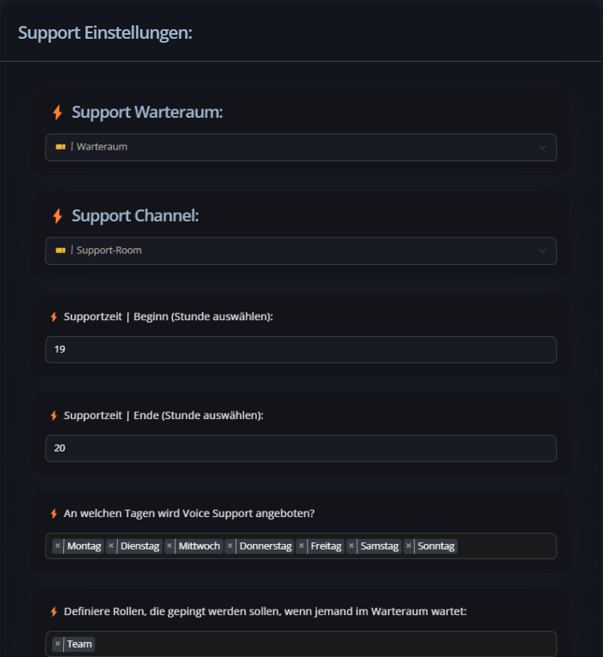

# Warteraum Ansagen

Wer zum Ticket-Support auch einen Voice-Support anbietet, kann im Dashboard einen Warteraum, Öffnungszeiten und Ping-Rollen definieren:

<figure><figcaption></figcaption></figure>

Der Bot reagiert darauf wie folgt:

* **Voice Support geöffnet:**\
  Der Bot joined in den Channel, spielt die Ansage ab und schickt eine Nachricht in die Ticket-Area, dass ein User im Warteraum wartet. Sind Ping-Rollen ausgewählt, werden diese auch gepingt.
* **Voice Support geschlossen:**\
  Der Bot joined in den Channel, spielt die Ansage ab und schickt dem User per DM die Öffnungszeiten des Voice Supports. Hat der User DMs deaktiviert, wird natürlich keine DM verschickt

Was noch nicht funktioniert, aber geplant ist:

* Eigene Ansagen hochladen
* Öffnungstage auswählen
* Verschiedene Zeiten pro Tag auswählen

Copyright:\
_Bilder, Töne, Ansagen, etc ... die vom PowerBot erstellt werden, gehören auch dem PowerBot. Es ist nicht gestattet diese Bilder, Töne Ansagen, etc ... aufzuzeichnen, zu kopieren, zu verändern, ... --> Siehe Copyright und Urheberrecht. Das sollte grundsätzlich logisch sein. Dennoch möchte ich es erwähnen. Wir müssen gewisse Sounds selber kaufen. Werden diese "geklaut" verletzt man nicht nur unser Recht, sondern verstößt auch gegen Lizenzbestimmungen von Dritten._
