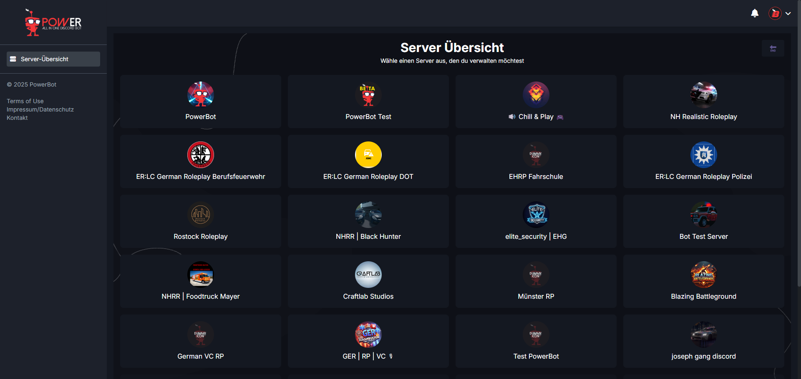
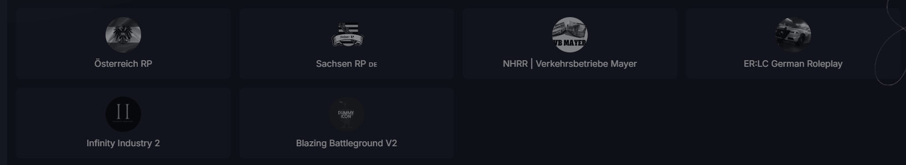

---
layout:
  title:
    visible: true
  description:
    visible: false
  tableOfContents:
    visible: true
  outline:
    visible: true
  pagination:
    visible: true
---

# 1) Bot einladen

**VORAB: Der Bot befindet sich momentan in der Beta-Phase. Je nach Beta-Status kannst du den Bot nur auf deinen Discord-Server holen, wenn du dich für die Beta-Phase beworben hast und angenommen wurdest (In Ausnahmefällen, wenn der Button auf ´Keine Bewerbung erforderlich´ steht, ist eine Bewerbung nicht erforderlich). Dies siehst du** [**>>> hier <<<**](https://discord.com/channels/994975619521712219/1199439009903017994)**. Wenn du den Kanal nicht öffnen kannst, muss du zuerst unserem Discord joinen:** [**https://discord.pwr.lol**](https://discord.pwr.lol)

Gehe auf [dash.pwr.lol](https://dash.pwr.lol) und klicke auf den Menüpunkt „Discord Server verwalten“. Es öffnet sich ein Fenster von Discord bei dem du dich\
verifizieren musst. Nach der Verifizierung wirst du auf die Dashboard Seite weitergeleitet.

Auf der Übersichtsseite siehst du nun alle Discord-Server bei denen du Admin bist:

* In Farbe sind die Discord-Server, wo der Bot bereits eingeladen wurde
* Farblos sind die Discord-Server bei denen du Admin bist, wo der Bot aber noch nicht eingeladen wurde

<figure><figcaption></figcaption></figure>

<figure><figcaption></figcaption></figure>

Wenn du den Bot auf einen deiner Server einladen möchtest, klickst du einfach auf das Symbol des jeweiligen Discord-Servers. Es öffnet sich erneut ein Discord-Fenster, wo\
du die Einladung authentifizieren musst. Hast du dies erledigt, bekommst du vom Bot eine DM, wo nochmal alles wichtige erwähnt wurde. (Sofern du DM´s aktiviert hast.)

**WICHTIG:**\
Discord erstellt automatisch eine sogenannte "Integrations Rolle" für den Bot. Diese hat bereits die erforderlichen Rechte. Du brauchst sie nur noch ganz nach oben schieben, damit der Bot ordentlich funktioniert. Keine Angst: Du als Guild Owner bist immer immun.
