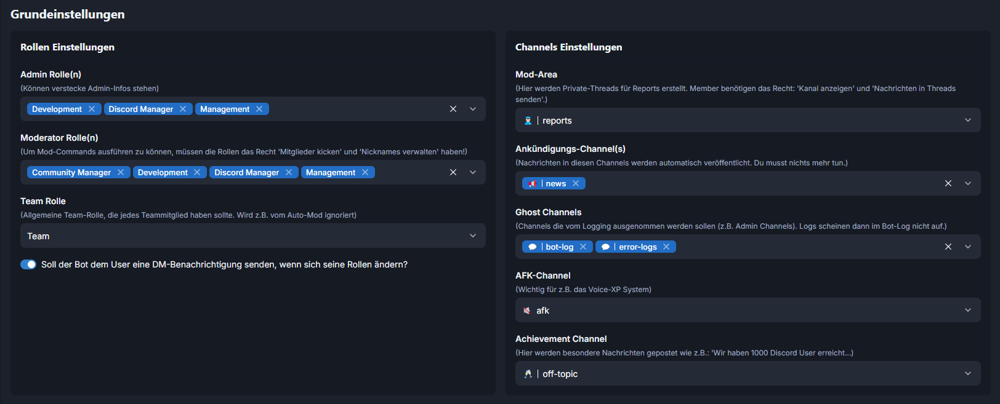
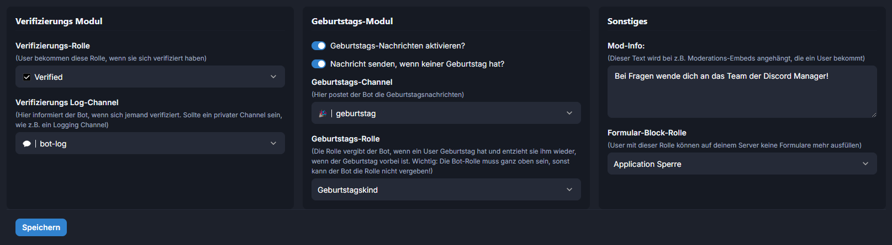

# 2) Grundeinstellungen

Im Bereich „Grundeinstellungen“ findest du alle wichtigen Optionen, damit der Bot bei deinem Discord-Server so funktioniert wie er soll. Arbeite diesen Bereich Punkt für Punkt durch.

<figure><figcaption></figcaption></figure>

<figure><figcaption></figcaption></figure>

