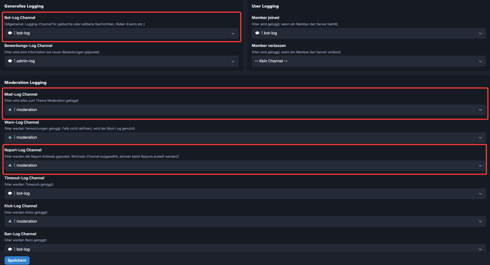

# 3) Logging Channel definieren

Du möchtest das Logging aktivieren? Dafür musst du nur drei Channel definieren:

* Allgemeiner Bot-Log Channel
* Allgemeiner Mod-Log Channel
* Report-Log Channel

Du kannst natürlich auch einen Channel für alles auswählen. So wie du das möchtest.

Du möchtest, dass gewisse Meldungen in andere Channel geloggt werden? Dann kannst du noch weitere Log-Channel definieren. Bleiben diese leer, werden diese Themen (Kick, Ban, Warn, …) in den Mod-Log Channel gepostet.

<figure><figcaption></figcaption></figure>
